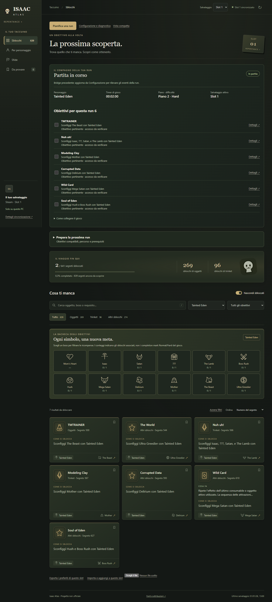
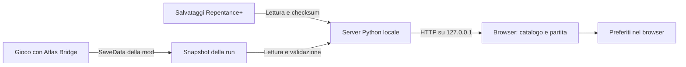

<div align="center">


# Isaac Atlas

**Il tuo taccuino per gli sblocchi di The Binding of Isaac: Repentance+.**

Trova quello che ti manca, prepara la prossima run e segui la partita dal browser.

**1.0.0-rc.1 · Desktop Windows / Python 3.10+ · GPL-3.0-only**

[Installazione](#installazione) · [Configurazione](#configurazione) · [Modalità live](#modalità-live) · [Fonti](#fonti-e-attribuzioni) · [Problemi comuni](#problemi-comuni)

</div>



> Progetto non ufficiale, eseguito sul tuo computer. Non richiede un account, non invia i progressi online e non modifica i salvataggi del gioco. La mod opzionale scrive soltanto i propri dati di collegamento.

## Verso la 1.0

La candidata 1.0 aggiunge **configurazione guidata, pianificazione delle run, eventi live, preferiti trasferibili e app desktop Windows**. Stato delle verifiche e limiti: [milestone](docs/ROADMAP-1.0.md), [changelog](CHANGELOG.md).

**App desktop:** quando il pacchetto è disponibile negli asset della release, estrai l’intero ZIP e avvia `IsaacAtlas.exe`. Python è incluso. Requisiti WebView2, configurazione e compilazione: [guida desktop](docs/DESKTOP.md).

**Da sorgente:** restano validi i comandi Python descritti sotto. Non confondere una release candidate con un rilascio già pubblicato: gli archivi locali e il workflow di build non creano automaticamente una release GitHub.

## Cosa offre

- **641 segreti di Repentance+** con requisiti, ricerca e collegamenti alle guide.
- **Tre slot separati**: progressi e lista “Da provare” seguono il salvataggio selezionato.
- **Sblocchi mancanti in primo piano**, con filtri per personaggio, boss e tipo di ricompensa.
- **Rilevamento automatico** di Steam, librerie aggiuntive e cartelle note dei salvataggi.
- **Casi d’uso e sinergie con fonti**, consultabili dai dettagli e dai preferiti.
- **Partita in corso**, tramite una mod opzionale: personaggio, timer, piano, difficoltà e checklist degli obiettivi.
- **Funzionamento locale**: i dati inclusi nel repository sono disponibili offline; aprire le fonti esterne richiede Internet.

I contatori misurano **segreti**, non singoli oggetti: un segreto può assegnare più ricompense. Un oggetto già sbloccato ma mai raccolto non viene riproposto come mancante.

### Contenuto della prima beta pubblica

Questa distribuzione include il catalogo degli sblocchi, le note originali sui casi d’uso e i collegamenti alle wiki. **Non include gli sprite del gioco né le descrizioni importate da External Item Descriptions**, in attesa di chiarire i diritti di redistribuzione. Sono incluse alcune nuove descrizioni originali con fonte e data di verifica documentale. Dove manca una descrizione, la scheda rimanda alla guida completa. Le note sulle sinergie sono selettive, non esaustive.

## Requisiti e compatibilità

| Componente | Requisito / stato |
| --- | --- |
| Gioco | The Binding of Isaac con **Repentance+**, salvataggi già creati |
| Python | **3.10 o successivo**, solo libreria standard |
| Browser | Browser desktop moderno; verifiche automatiche eseguite con Microsoft Edge |
| Windows | Rilevamento Steam e collegamento live verificati su un’installazione reale |
| Linux / Proton / WSL | Percorsi noti contemplati; test backend su Linux, ma nessuna garanzia di compatibilità completa con il gioco |
| macOS | Ricerca della cartella Steam prevista; supporto del gioco e modalità live non verificati |
| Mod | Opzionale per la modalità live; il taccuino dei salvataggi funziona senza |

Non servono Codex, Node.js, un database, una chiave API o un abbonamento. Node.js e Playwright sono necessari soltanto per i test browser facoltativi.

## Installazione

### 1. Scarica il progetto

Nella pagina GitHub del repository scegli **Code → Download ZIP**, quindi estrai l’archivio in una cartella scrivibile. In alternativa, copia l’URL mostrato in **Code** e usa `git clone` con quell’URL.

Apri un terminale **nella cartella che contiene `launch.py` e `server.py`**. Non avviare direttamente `dist/index.html`: l’interfaccia richiede il lettore locale dei salvataggi.

### 2. Installa e verifica Python

Installa Python dal [sito ufficiale](https://www.python.org/downloads/). Su Windows abilita l’opzione per aggiungerlo al `PATH`, se proposta dall’installer.

**Windows — PowerShell o Prompt dei comandi:**

```powershell
py -3 --version
```

**Linux / ambienti compatibili:**

```sh
python3 --version
```

La versione deve essere almeno 3.10. Se su Windows usi il comando `python` invece di `py -3`, puoi sostituirlo anche nei comandi seguenti. Non è necessario eseguire `pip install` per utilizzare l’app.

### 3. Avvia Isaac Atlas

**Windows:** fai doppio clic su **`Apri Isaac Atlas.cmd`**, oppure esegui:

```powershell
py -3 launch.py
```

**Linux / ambienti compatibili:**

```sh
python3 launch.py
```

L’app apre **[http://127.0.0.1:8765](http://127.0.0.1:8765)** nel browser. Lascia aperto il terminale mentre la usi; premi **Ctrl+C** per fermare il servizio. Chiudere soltanto la scheda del browser non arresta il server.

Se Isaac Atlas è già attivo sulla porta predefinita, il launcher apre la sua pagina. Per scegliere un’altra porta su Windows:

```powershell
py -3 server.py --port 8766 --open
```

In questo caso l’indirizzo è `http://127.0.0.1:8766`. Per l’avvio senza apertura automatica del browser, ometti `--open`.

### 4. Collega un salvataggio

Avvia almeno una volta Repentance+ e salva una partita. Aprendo Atlas, il rilevamento cerca i file disponibili. Se viene trovato un solo profilo, viene usato automaticamente; se ne vengono trovati più di uno, scegli il profilo nell’app. Seleziona poi **Slot 1, 2 o 3**.

La prima lettura deve terminare con lo stato **“Slot … sincronizzato”**. Uno slot non disponibile produce un avviso: non viene trattato come uno slot vuoto né sostituito con i progressi di un altro.

## Configurazione

### Procedura guidata

Apri **Configurazione e diagnostica**. Puoi lasciare i percorsi vuoti per il rilevamento automatico oppure indicare le due cartelle e premere **Salva configurazione**. Nel desktop, **Scegli cartella** apre il selettore nativo; nel browser incolla il percorso. Il report diagnostico esportabile non contiene percorsi, identificativi Steam, seed o contenuti dei salvataggi.

Per la modalità live, chiudi Isaac, seleziona **Ho chiuso il gioco**, poi **Installa Bridge** o **Aggiorna Bridge**. Riavvia il gioco e abilita la mod. Le operazioni di scrittura riguardano solo configurazione Atlas e file della Bridge, protette da un token della sessione locale.

### Rilevamento automatico

Di norma non devi creare alcun file di configurazione. Il lettore:

1. Cerca Steam nel registro di Windows e nelle cartelle standard del sistema.
2. Legge `steamapps/libraryfolders.vdf` per trovare le librerie su altri dischi.
3. Individua la cartella del gioco tramite `appmanifest_250900.acf`.
4. Cerca i salvataggi Steam sotto `userdata/<profilo>/250900/remote` e quelli locali nelle cartelle Documenti note, incluse quelle reindirizzate e i percorsi Proton contemplati.
5. Quando rileva `SteamCloud=0` nelle opzioni locali, preferisce i salvataggi locali e non usa automaticamente le copie Cloud potenzialmente obsolete.

Il rilevamento cerca cartelle note; non effettua una scansione completa del computer e non verifica la licenza di acquisto del gioco.

### Percorsi manuali

Se il rilevamento non trova i file corretti, crea la configurazione privata:

```powershell
Copy-Item config.example.json config.json
```

Su Linux usa `cp config.example.json config.json`. Modifica `config.json` con un editor di testo, per esempio:

```json
{
  "save_directory": "D:/Steam/userdata/PROFILO/250900/remote",
  "game_directory": "D:/SteamLibrary/steamapps/common/The Binding of Isaac Rebirth"
}
```

**I percorsi sono esempi:** sostituiscili con quelli reali del tuo PC. Usa `/` nei percorsi JSON, oppure raddoppia ogni barra inversa (`\\`). Salva come JSON UTF-8, senza commenti o virgole finali. Riavvia Atlas e ricarica la pagina dopo le modifiche.

| Campo | Significato |
| --- | --- |
| `save_directory` | Cartella contenente i salvataggi dei tre slot. Se vuoto, usa il rilevamento automatico. |
| `game_directory` | Cartella del gioco, contenente `isaac-ng.exe`, `mods` e `data`. Imposta dove il lettore live cerca i dati della mod. Se vuoto, usa Steam. |

La cartella Steam contiene normalmente `rep+persistentgamedata1.dat`, `rep+persistentgamedata2.dat` e `rep+persistentgamedata3.dat`. Nella cartella locale `Documenti/My Games/Binding of Isaac Repentance+` i nomi supportati sono `persistentgamedata1.dat`, `persistentgamedata2.dat` e `persistentgamedata3.dat`.

È possibile impostare solo uno dei due campi. Anche l’installatore usa `game_directory` da `config.json`; l’opzione `--game-directory` permette di indicare esplicitamente un’altra cartella. Vedi i comandi nella sezione successiva.

Per una posizione Steam non standard puoi anche impostare `STEAM_PATH` prima dell’avvio; viene aggiunta alle posizioni cercate, senza sostituirle:

```powershell
$env:STEAM_PATH = "D:/Steam"
py -3 launch.py
```

`config.json` è ignorato da Git. Nel desktop compilato si trova nella cartella dati privata, non accanto all’eseguibile. Non aggiungerlo al repository né allegarlo integralmente a una segnalazione: può contenere percorsi e identificativi personali.

## Modalità live

### Installa la mod opzionale

Chiudi Isaac prima dell’installazione. Dalla cartella di Atlas esegui:

```powershell
py -3 install_bridge.py
```

L’installatore deve individuare una sola installazione del gioco. Se ne trova più di una, oppure usi una posizione particolare:

```powershell
py -3 install_bridge.py --game-directory "D:/SteamLibrary/steamapps/common/The Binding of Isaac Rebirth"
```

L’installatore copia esclusivamente `main.lua` e `metadata.xml` in `mods/isaac-atlas-bridge`. Per l’installazione manuale puoi copiare la cartella [mod/isaac-atlas-bridge](mod/isaac-atlas-bridge) nella cartella `mods` del gioco.

Riavvia Isaac, abilita **Isaac Atlas Bridge** nel menu **Mods**, avvia una run e lascia Atlas aperto. Non è necessario abilitare la console di debug o usare `--luadebug`.

> Su slot nuovi, verifica nel gioco l’idoneità agli achievement quando usi mod. Atlas non certifica che una run possa sbloccare segreti e non modifica le regole del gioco.

### Cosa vedrai

| Sezione | Comportamento |
| --- | --- |
| Stato | In partita, in pausa, partita terminata, menu o collegamento interrotto |
| Dati della run | Personaggio, timer del gioco, numero del piano, difficoltà e slot attivo |
| Obiettivi | Segreti mancanti associati al personaggio e compatibili con i filtri di difficoltà/modalità; i preferiti vengono prima |
| Checklist | Spunte manuali temporanee, distinte dagli sblocchi registrati dal gioco |
| Spunti dai preferiti | Note con almeno un oggetto coinvolto rilevato nell’inventario del primo giocatore; gli altri ingredienti e le condizioni vanno verificati |

Se la partita usa uno slot diverso da quello selezionato, Atlas mostra l’avviso e il comando per passare allo slot corretto. Non usa i progressi di uno slot per suggerire obiettivi di un altro.

I promemoria usano i limiti ordinari comunicati dal gioco: superarli non viene presentato come impossibilità assoluta, perché possono esistere eccezioni.

La mod aggiorna circa ogni secondo il proprio `saveX.dat`; il gioco assegna il numero di slot. Atlas interroga lo stato live ogni **1,5 secondi**. Dopo **8 secondi** senza un file aggiornato, timer e obiettivi live vengono nascosti: il browser non fa avanzare un timer presunto.

### Limiti attuali

- Le spunte della checklist rimangono manuali. Separatamente, la Bridge 1.0 rileva alcuni boss/eventi: Atlas mostra **evento osservato**, **accesso rilevato** o **sblocco confermato dal save**. Un evento boss da solo non dimostra tutti i requisiti di una ricompensa. Le spunte si azzerano al cambio sessione o al ricaricamento.
- I suggerimenti non verificano ancora tutti i percorsi accessibili, gli eventi già avvenuti o l’idoneità agli achievement.
- Per **sfide, seed personalizzati, cooperativa e più profili rilevati**, gli obiettivi automatici sono sospesi. La mod identifica lo slot, non l’account Steam.
- I personaggi aggiunti da altre mod non vengono associati automaticamente agli obiettivi vanilla.
- Le sinergie sono spunti documentati, non una garanzia che la combinazione sia completa o utilizzabile nella situazione corrente.
- La schermata vive nel browser: non è un overlay sovrapposto alla finestra del gioco. Puoi tenerla su un secondo monitor o consultarla passando al browser.

### Aggiornamento e rimozione

Puoi aggiornarla dal pannello Configurazione, oppure, a gioco chiuso:

```powershell
py -3 install_bridge.py --update
```

Aggiungi `--game-directory "percorso"` se necessario. Senza `--update`, una cartella Bridge già esistente non viene sovrascritta.

Per rimuoverla, disabilitala nel menu Mods e, a gioco chiuso, elimina soltanto `mods/isaac-atlas-bridge`. Se vuoi eliminare anche i suoi dati, rimuovi la sola cartella `data/isaac-atlas-bridge` ove presente. Non cancellare la cartella `data` intera o i salvataggi persistenti di Isaac. Il taccuino degli sblocchi continua a funzionare senza la mod.

## Pianifica una run

Apri **Pianifica una run**, scegli personaggio, difficoltà e, facoltativamente, un obiettivo principale. Oppure usa **Pianifica questo obiettivo** nel dettaglio di una ricompensa. Atlas esclude gli sblocchi già confermati e ordina le proposte dando priorità ai preferiti.

Ogni proposta distingue tappe principali e opzionali, mostra un percorso standard, elenca prerequisiti da controllare e cita la guida. Chest e Dark Room, Mother e Home non vengono uniti come se fossero un unico percorso ordinario. Gli obiettivi cumulativi o non riconducibili alle regole del planner restano nel catalogo.

Il planner non certifica l’accessibilità di ogni area sul salvataggio: i metodi alternativi, i portali casuali e tutte le eccezioni non sono simulati.

## Uso del taccuino

- **Sblocchi:** nasconde inizialmente i segreti già ottenuti; disattiva “Nascondi sbloccati” per vedere tutto.
- **Ricerca:** cerca nome, boss, requisito o numero del segreto. Premi `/` per portare il cursore nel campo.
- **Filtri:** combina personaggio, obiettivo e tipo di ricompensa; “Azzera filtri” ripristina la vista.
- **Per personaggio / Sfide:** consulta gli obiettivi delle due categorie.
- **Da provare:** usa il segnalibro sulle schede. I preferiti rimangono visibili anche dopo lo sblocco, insieme alle note disponibili.
- **Dettaglio:** apri una scheda per requisito, testo originale, eventuali note e link alle fonti.
- **Preferiti trasferibili:** esporta lo slot corrente e importa il file sul browser/PC di destinazione. L’importazione aggiunge gli ID validi allo slot collegato, senza cancellare i preferiti esistenti.
- **Sincronizzazione:** il salvataggio viene riletto ogni **5 secondi**; il pulsante di aggiornamento richiede una nuova lettura.

I preferiti sono locali al browser e separati per sorgente e slot. Cambiare browser, indirizzo (`localhost` invece di `127.0.0.1`) o porta crea un contesto di memorizzazione diverso. I preferiti dei vecchi slot vengono recuperati quando è rilevata una sola sorgente; non vengono assegnati automaticamente a un profilo ambiguo.

## Come funziona



Il lettore valida struttura e checksum del salvataggio e controlla che il file non sia cambiato durante la lettura. Se un aggiornamento fallisce, mantiene l’ultimo risultato valido **dello stesso slot** e mostra un avviso. Al cambio slot, i dati precedenti vengono rimossi in attesa della nuova lettura.

La mod usa le API Lua del gioco e `ModReference:SaveData`; non accede alla memoria di altri processi. Il backend accetta snapshot limitati a 64 KiB e ne verifica lo schema. Dettagli degli endpoint e dei file: [architettura e API locali](docs/ARCHITECTURE.md).

### Struttura del repository

```text
├── server.py                 # HTTP locale e parser dei salvataggi
├── discovery.py              # Rilevamento Steam, librerie e sorgenti
├── live.py                   # Lettura e validazione degli snapshot live
├── launch.py                 # Avvio e apertura nel browser
├── install_bridge.py         # Installazione della mod opzionale
├── config.example.json       # Modello privo di dati personali
├── dist/                     # Interfaccia e cataloghi distribuiti
├── mod/isaac-atlas-bridge/    # Sorgente Lua e metadati della mod
├── tests/                    # Test Python e browser con dati sintetici
├── docs/                     # API e indice delle fonti
└── .github/                  # CI e modelli per issue e pull request
```

## Privacy e sicurezza

Il servizio ascolta esclusivamente su **`127.0.0.1`** ed è destinato all’uso sullo stesso computer. Non esporlo su Internet o sulla LAN. Non è un servizio autenticato per più utenti.

Non sono presenti telemetria, login o caricamenti automatici dei salvataggi. I preferiti restano nel `localStorage` del browser; la checklist resta nella memoria della pagina. I collegamenti alle fonti aprono siti esterni. I dettagli sono in [PRIVACY.md](PRIVACY.md).

Non allegare salvataggi, file della mod, `config.json` o log integrali alle segnalazioni. Per questioni di sicurezza consulta [SECURITY.md](SECURITY.md).

## Problemi comuni

| Problema | Cosa controllare |
| --- | --- |
| `py` / `python` non trovato | Installa Python 3.10+, verifica il `PATH` e riapri il terminale. Prova `py -3` su Windows. |
| Il browser mostra errori aprendo un file HTML | Avvia `launch.py` e usa l’indirizzo HTTP locale, non `file://`. |
| Nessun salvataggio trovato | Verifica Repentance+, avvia e salva una partita; imposta `save_directory` se necessario. |
| Più profili trovati | Scegli la sorgente nell’app oppure indica la cartella corretta nella configurazione privata. |
| Slot non disponibile | Avvia quello slot nel gioco e salva. Gli slot non creati non vengono considerati vuoti. |
| Checksum / file in aggiornamento | Attendi il tentativo successivo; controlla che il gioco abbia finito di salvare. Non modificare il file per aggirare la verifica. |
| “Mod non collegata” | Riavvia Isaac, abilita Bridge e avvia una run. Verifica la cartella del gioco e, se necessario, `game_directory`. |
| “Collegamento interrotto” | Il file non viene aggiornato da oltre 8 secondi. Controlla gioco, mod e stato di sospensione; Atlas riprova automaticamente. |
| Il timer appare ma mancano gli obiettivi | Controlla slot selezionato, presenza di più profili e modalità speciale/cooperativa. Leggi l’avviso nella sezione live. |
| Preferiti non visibili | Verifica browser, indirizzo, porta, sorgente e slot; non vengono sincronizzati tra dispositivi. |
| Porta 8765 occupata | Se non è Atlas, usa `server.py --port 8766 --open`. |
| Configurazione non valida | Controlla sintassi JSON, codifica UTF-8, barre dei percorsi e assenza di commenti. |
| Immagini o descrizioni assenti | Nella beta pubblica alcuni materiali sono esclusi intenzionalmente; usa i collegamenti alle guide. |

Per aggiornare Atlas, chiudi il server e sostituisci il codice con la nuova versione, conservando la tua configurazione privata. Se hai modifiche locali a un clone Git, esaminale prima di aggiornare. Aggiorna separatamente Bridge quando cambia la mod.

## Sviluppo, test e contributi

Test backend, senza dipendenze aggiuntive:

```powershell
py -3 -m unittest discover -s tests -v
```

Su Linux: `python3 -m unittest discover -s tests -v`. I test generano file sintetici in cartelle temporanee: non richiedono salvataggi reali.

La configurazione CI esegue la suite su **Ubuntu e Windows, Python 3.10 e 3.13**. Le verifiche locali eseguite sono documentate in [VERIFICHE.md](VERIFICHE.md); il superamento della CI remota sarà visibile dopo il push, non è presunto.

Per i test browser facoltativi avvia il server, quindi in un ambiente di sviluppo con Node.js:

```sh
npm install --no-save playwright
npx playwright install chromium
node tests/browser.cjs
```

Le risposte di salvataggi e run vengono simulate. Opzioni per Edge e porte diverse: [tests/README.md](tests/README.md). Per segnalare problemi, proporre modifiche o aggiungere fonti consulta [CONTRIBUTING.md](CONTRIBUTING.md).

## Fonti e attribuzioni

| Fonte | Uso nel progetto |
| --- | --- |
| [Isaac Save Viewer — Zamiell](https://github.com/Zamiell/isaac-save-viewer) | Catalogo di partenza e riferimenti per il formato dei salvataggi; snapshot `57d96c3f6a27aa2d95b4af30b4e80b8bec4b7d2d`, GPL-3.0. |
| [Isaac Save Manager — Demorck](https://github.com/Demorck/Isaac-save-manager) | Confronto tecnico del formato dei salvataggi. |
| [IsaacScript](https://github.com/IsaacScript/isaacscript) | Confronto dei nomi tecnici e degli identificatori. |
| [Wiki di Isaac — Achievements](https://bindingofisaacrebirth.wiki.gg/wiki/Achievements) | Requisiti e riferimenti per i segreti. |
| [Wiki — achievement di Repentance+](https://bindingofisaacrebirth.wiki.gg/wiki/Achievements/Repentance%2B) | Riferimenti per i segreti aggiuntivi di Repentance+. |
| [Wiki Fandom](https://bindingofisaacrebirth.fandom.com/wiki/Binding_of_Isaac:_Rebirth_Wiki) | Fonte di riferimento iniziale e collegamenti alternativi nelle schede. |
| [Isaac Lua API — ModReference](https://wofsauge.github.io/IsaacDocs/rep/ModReference.html) | API `SaveData` della mod e associazione ai tre slot. |
| [Isaac Lua API — Game](https://wofsauge.github.io/IsaacDocs/rep/Game.html) | Stato del gioco, pausa, difficoltà e timer. |
| [Isaac Lua API — EntityPlayer](https://wofsauge.github.io/IsaacDocs/rep/EntityPlayer.html) | Personaggio e inventario del giocatore. |
| [Isaac Lua API — Isaac](https://wofsauge.github.io/IsaacDocs/rep/Isaac.html) e [Seeds](https://wofsauge.github.io/IsaacDocs/rep/Seeds.html) | Temporizzazione degli aggiornamenti e riconoscimento delle run personalizzate. |
| [External Item Descriptions — Wofsauge e collaboratori](https://github.com/wofsauge/External-Item-Descriptions) | Fonte della precedente importazione di descrizioni, **esclusa dalla distribuzione pubblica**; commit consultato `b6010e390ef2f429d4d4659974a5d505fba89b43`. |

Ogni caso d’uso distribuito ha collegamenti puntuali in [strategies.json](dist/data/strategies.json). L’[indice delle fonti](docs/SOURCES.md) raccoglie tutte le pagine citate dalle note; i riferimenti delle singole ricompense sono nel [catalogo](dist/data/catalog.json). Attribuzioni e distinzione fra materiali inclusi ed esclusi: [THIRD_PARTY.md](THIRD_PARTY.md).

Le fonti della community possono cambiare con le patch. Una nota documentata non garantisce che tutti i suoi prerequisiti siano soddisfatti nella run attuale.

## Licenza e indipendenza

Il codice è distribuito sotto **GNU GPL v3 (`GPL-3.0-only`)**. Leggi [LICENSE](LICENSE) per le condizioni complete e [THIRD_PARTY.md](THIRD_PARTY.md) per i materiali derivati e le attribuzioni.

Isaac Atlas non è affiliato agli autori o agli editori di The Binding of Isaac, a Steam, alle wiki o ai progetti citati. Nomi e marchi appartengono ai rispettivi titolari. Non vengono distribuiti eseguibili, DLL o asset grafici del gioco.

Per la prima pubblicazione del repository: [checklist di rilascio](RELEASE_CHECKLIST.md).

## Bacheca illustrata

I simboli dei boss filtrano il catalogo con un clic e mostrano il numero di ricompense associate sbloccate. Il filtro personaggio aggiorna i conteggi; un secondo clic rimuove il filtro boss. Non sono una lettura dei completion mark Normal/Hard del gioco. La versione pubblica include illustrazioni SVG originali; gli sprite eventualmente presenti nella copia locale non vengono redistribuiti.
